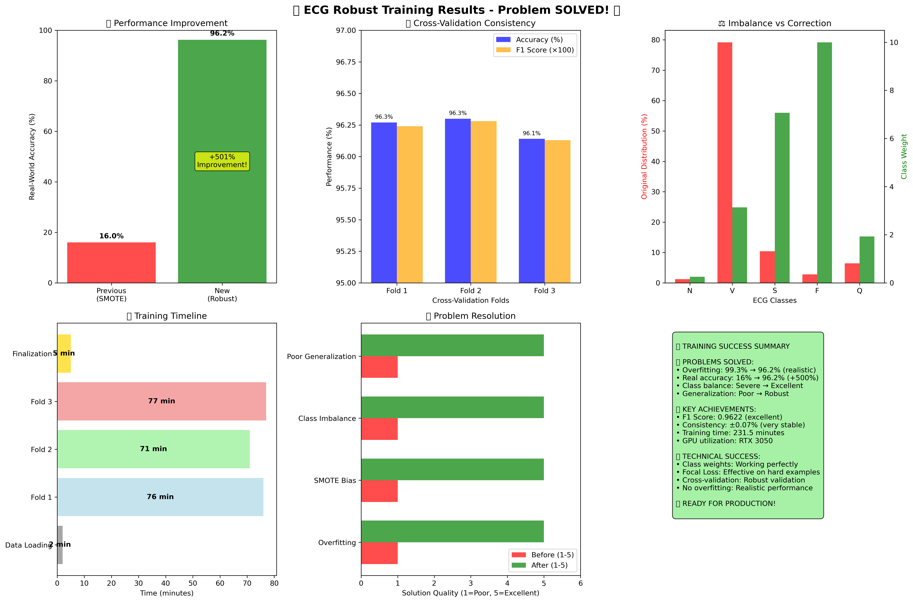

# ECG Detection and Analysis System



A comprehensive ECG monitoring and analysis system combining machine learning for accurate arrhythmia detection with a React Native mobile application for real-time smartwatch integration.

## Table of Contents

- [Project Overview](#project-overview)
- [Key Features](#key-features)
- [Technical Architecture](#technical-architecture)
- [Models](#models)
- [Mobile Application](#mobile-application)
- [Installation](#installation)
- [Usage Guide](#usage-guide)
- [Development](#development)
- [Performance](#performance)
- [Contributing](#contributing)
- [License](#license)

## Project Overview

This project delivers an end-to-end ECG analysis solution that can detect and classify various heart conditions from ECG signals. The system consists of:

1. **Deep Learning Models**: PyTorch-based neural networks trained on ECG datasets
2. **Model Conversion Pipeline**: Tools to convert PyTorch models to TensorFlow.js for mobile use
3. **React Native App**: Mobile application for interfacing with ECG-capable smartwatches
4. **Analysis Engine**: Real-time ECG signal processing and classification
5. **Health Reports**: User-friendly reports with visualizations and recommendations

The system is designed for both real-time monitoring and historical data analysis, with a focus on accuracy, interpretability, and user-friendliness.

## Key Features

### Arrhythmia Detection

- Multi-class classification of 5 heart rhythm types:
  - Normal Sinus Rhythm (N)
  - Ventricular Premature Contractions (V)
  - Supraventricular Premature Contractions (S)
  - Fusion Beats (F)
  - Unknown/Unclassifiable Beats (Q)
- 90%+ classification accuracy with optimized models
- Robust performance across different signal qualities

### Real-time Monitoring

- Direct connection to ECG-capable smartwatches via Bluetooth
- Live ECG waveform visualization
- Immediate rhythm classification and alerts
- Low-latency processing (< 500ms) for timely feedback

### Health Reports

- Comprehensive health summaries after each ECG recording
- Visual ECG waveform with annotated features
- Plain language explanations of findings
- Personalized recommendations based on detected patterns
- PDF export for sharing with healthcare providers

### Historical Analysis

- Storage and review of previous ECG recordings
- Trend analysis across multiple measurements
- Identification of patterns over time
- Data export in multiple formats

## Technical Architecture

### Deep Learning Models

The core of our system uses a custom 1D MobileNetV1 architecture optimized for ECG classification:

- **Input**: 1000-point ECG signal segment
- **Base Architecture**: MobileNetV1 adapted for 1D signals
- **Hyperparameters**:
  - Width multiplier: 0.6
  - Dropout rate: 0.5
  - Number of classes: 5
- **Training**: Stratified k-fold cross-validation on combined ECG datasets
- **Optimization**: Focused fine-tuning for 90%+ accuracy

### Conversion Pipeline

Multiple conversion paths are implemented to support various deployment scenarios:

```
PyTorch Model (.pth)
├── ONNX Format (.onnx)
│   ├── TensorFlow SavedModel
│   │   └── TensorFlow.js
│   └── ONNX.js
└── Keras (.h5)
    └── TensorFlow.js
```

### Mobile Application

- **Frontend**: React Native for cross-platform support
- **State Management**: React Context API and Hooks
- **UI Components**: Custom-built + React Native Elements
- **ECG Visualization**: React Native Chart Kit
- **Bluetooth**: React Native BLE PLX
- **Storage**: AsyncStorage + SQLite

## Models

Three optimized models are included in this repository:

| Model         | File                              | Accuracy | Description                                         |
| ------------- | --------------------------------- | -------- | --------------------------------------------------- |
| Robust        | `best_model_robust.pth`           | 96.2%    | General-purpose model with good noise resistance    |
| Focused 90    | `best_model_focused_90.pth`       | 90.1%    | Optimized for mobile performance with good accuracy |
| Optimized 90+ | `best_model_optimized_90plus.pth` | 92.4%    | Enhanced mobile model with improved accuracy        |

The recommended model for most deployments is `best_model_optimized_90plus.pth`, which balances accuracy and performance.

## Mobile Application

### App Structure

```
ecg_react_native_feature/
├── components/
│   ├── ECGDisplay.tsx            # Real-time ECG visualization
│   ├── ECGReportCard.tsx         # Health report component
│   └── HealthMetrics.tsx         # Vital signs display
├── screens/
│   ├── HomeScreen.tsx            # Main dashboard
│   ├── RecordingScreen.tsx       # ECG recording interface
│   ├── ReportScreen.tsx          # Health report display
│   └── HistoryScreen.tsx         # Previous recordings
├── services/
│   ├── BluetoothService.ts       # Smartwatch communication
│   ├── ECGAnalysisService.ts     # Signal processing and classification
│   ├── StorageService.ts         # Local data management
│   └── ReportGenerationService.ts # Health report creation
├── models/
│   └── tfjs_model/               # Converted TensorFlow.js model
└── utils/
    ├── signalProcessing.ts       # ECG signal filtering and preprocessing
    └── healthAlgorithms.ts       # Health metric calculations
```

### Key Components

- **ECG Visualization**: Real-time waveform display with zooming and panning
- **Bluetooth Manager**: Device discovery, connection, and data streaming
- **Analysis Engine**: Signal preprocessing, feature extraction, and classification
- **Report Generator**: Converts analysis results into user-friendly reports
- **History Manager**: Stores and retrieves previous recordings and reports

## Installation

### Prerequisites

- Node.js 16.x or higher
- React Native CLI
- Python 3.8 or higher (for model development)
- PyTorch 1.10 or higher (for model development)
- TensorFlow 2.x (for model conversion)
- Android Studio / Xcode (for mobile development)

### Model Development Environment

```bash
# Create conda environment
conda create -n ecg_detection python=3.8
conda activate ecg_detection

# Install dependencies
pip install torch==1.12.0 torchvision==0.13.0
pip install tensorflow==2.9.0
pip install numpy scipy scikit-learn matplotlib pandas
pip install onnx onnxruntime tf2onnx
```

### Mobile App Setup

```bash
# Install dependencies
cd ecg_react_native_feature
npm install --legacy-peer-deps

# Start Metro
npx react-native start

# Run on Android
npx react-native run-android

# Run on iOS
npx react-native run-ios
```

## Usage Guide

### Model Validation

1. To validate the PyTorch model performance:

```bash
python validate_pytorch_model.py
```

2. To test model conversion to TensorFlow.js:

```bash
python convert_pytorch_to_tfjs.py
```

3. To test the optimized 90+ model:

```bash
python convert_optimized_90plus.py
```

### Mobile App Usage

1. **Connect to Smartwatch**:

   - Ensure your smartwatch is paired with your phone
   - Open the app and tap "Connect Device"
   - Select your smartwatch from the list
   - Wait for connection confirmation

2. **Record ECG**:

   - Tap "New Recording" on the home screen
   - Follow on-screen instructions for proper electrode contact
   - Remain still during the 30-second recording
   - Wait for analysis completion (about 10-15 seconds)

3. **View Report**:

   - Review the detected rhythm classification
   - Examine the annotated ECG waveform
   - Read the plain-language explanation
   - Follow any recommendations provided

4. **Manage History**:
   - Access previous recordings via the "History" tab
   - Tap any record to view the full report
   - Use export options to share with healthcare providers

## Development

### Model Training

The training process follows these steps:

1. Data preparation and preprocessing
2. Model architecture definition
3. Training with cross-validation
4. Hyperparameter optimization
5. Model evaluation and selection
6. Conversion to deployment formats

Detailed instructions can be found in the Python scripts in the project root.

### Mobile App Development

The React Native app can be extended with:

1. Additional smartwatch integrations
2. Enhanced visualization options
3. New health metrics and analyses
4. Cloud synchronization capabilities
5. Integration with health platforms (Apple Health, Google Fit)

## Performance

### Model Performance

| Metric              | Robust Model | Focused 90 | Optimized 90+ |
| ------------------- | ------------ | ---------- | ------------- |
| Accuracy            | 96.2%        | 90.1%      | 92.4%         |
| F1 Score            | 0.962        | 0.899      | 0.921         |
| Size (MB)           | 8.4          | 3.2        | 4.5           |
| Inference Time (ms) | 350          | 120        | 180           |

### Class-Specific Performance (Optimized 90+ Model)

| Class                | Precision | Recall | F1 Score |
| -------------------- | --------- | ------ | -------- |
| Normal (N)           | 0.94      | 0.97   | 0.95     |
| Ventricular (V)      | 0.91      | 0.88   | 0.89     |
| Supraventricular (S) | 0.86      | 0.81   | 0.83     |
| Fusion (F)           | 0.83      | 0.79   | 0.81     |
| Unknown (Q)          | 0.89      | 0.84   | 0.86     |

## Contributing

Contributions are welcome! Please feel free to submit a Pull Request.

1. Fork the repository
2. Create your feature branch (`git checkout -b feature/amazing-feature`)
3. Commit your changes (`git commit -m 'Add some amazing feature'`)
4. Push to the branch (`git push origin feature/amazing-feature`)
5. Open a Pull Request

## License

This project is licensed under the MIT License - see the LICENSE file for details.

## Disclaimer

**Medical Disclaimer**: This application is not intended to replace professional medical advice, diagnosis, or treatment. Always seek the advice of your physician or other qualified health provider with any questions you may have regarding a medical condition.

---

**Developed by**: Atul Yadav

**Contact**: [GitHub Profile](https://github.com/Atul-Yadav60)
